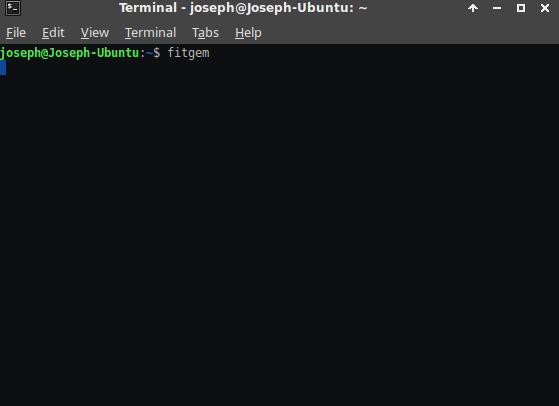
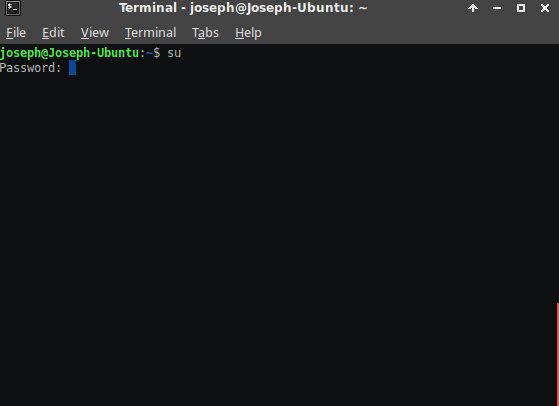

# fitgem [](https://travis-ci.org/juniorRubyist/fitgem) [](https://coveralls.io/github/juniorRubyist/fitgem?branch=master) :octocat:
A Ruby based Fitbit CLI client.

Fitgem is an interactive CLI Fitbit client that can grab your basic activities from Fitbit.com and print them on your console.


## Contents
* [Dependencies/Requirements](#dependenciesrequirements)
* [Install](#install)
  * [RubyGems Method](#rubygems-method-)
  * [Portable Installation](#portable-installation)
* [Basic Usage](#basic-usage)

## Dependencies/Requirements
* `ruby`
* `httparty` and `multi-json` libraries
* Linux/Mac OSX 

## Install
### RubyGems Method [](https://badge.fury.io/rb/fitgem-app)


1. Install RubyGems (only on Linux, if you don't have it)
  1. Clone the RubyGems repository.
    
    ```sh
    $ git clone https://github.com/rubygems/rubygems.git
    ```
  2. `cd` into the repository.
  
    ```sh
    $ cd rubygems
    ```
  3. Run `setup.rb` with root privileges.
  
    ```sh
    # ruby setup.rb
    ```
2. Install the `fitgem-app` gem.
  
  ```sh
  # gem install fitgem-app
  ```
3. Go to https://juniorrubyist.github.io/fitgem/authorize.html and click <kbd>Authorize Fitbit</kbd>.
4. Sign in to Fitbit, then copy your keys to your `.bashrc` or default shell configuration:

  ```sh
  export FB_ACCESS_TOKEN="YOUR_TOKEN_IN_QUOTES"
  export FB_USER_ID="YOUR_USER_ID_IN_QUOTES"
  ```
5. Type `fitgem` in a terminal window.

### Portable Installation


1. Clone the fitgem repository.

  ```sh
  git clone https://github.com/juniorRubyist/fitgem.git
  ```
2. `cd` into `fitgem/bin`.

  ```sh
  cd fitgem/bin
  ```
3. Copy fitgem to your Desktop, home folder, etc.

  ```sh
  cp fitgem /your/destination/folder
  ```
4. Follow step 4 above.
5. Run `./fitgem` from where you installed it.

## Basic Usage

* Use command `a` to print all of your basic data.
* Use command `s` to print your steps data.
* Use command `d` to print your distance data
* Use command `f` to print your floors data.
* Use command `c` to print your calories data.
* Use command `x` to exit fitgem.
